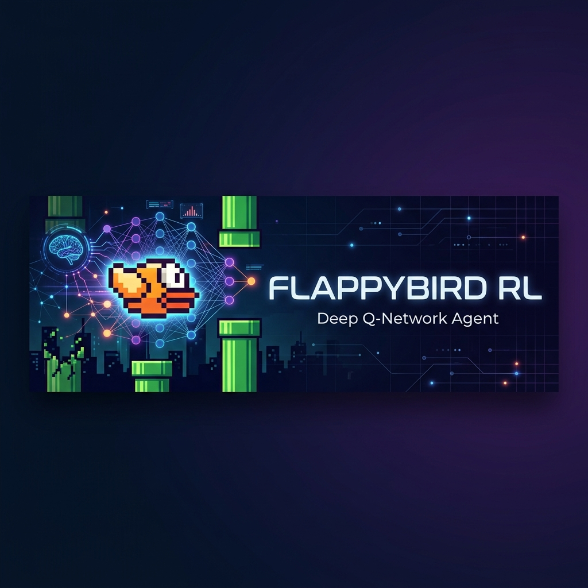

<p align="center">
  
</p>

<h1 align="center"> FlappyBird RL — Deep Q-Network Agent</h1>

<p align="center">
  <em>Teaching an AI to play Flappy Bird using Deep Reinforcement Learning</em>
</p>

<p align="center">
  
  
  
  
</p>

---

##  Overview

This project implements a **Deep Q-Network (DQN)** agent that learns to play Flappy Bird from scratch through reinforcement learning. The agent observes the game state (bird position, velocity, pipe gaps, etc.) and learns an optimal policy to navigate through pipes — without any hard-coded rules.

###  Key Features

-  **Deep Q-Learning** — Neural network approximates the Q-value function for continuous state spaces
-  **Experience Replay** — Randomized sampling from a replay buffer breaks temporal correlations and stabilizes training
-  **Target Network** — Separate target network for computing TD targets, periodically synced to prevent oscillation
-  **Epsilon-Greedy Exploration** — Decaying ε-greedy strategy balances exploration vs. exploitation
-  **Interactive Play Mode** — Play the game manually with keyboard controls to compare against the AI
-  **GPU Accelerated** — Automatic CUDA / MPS detection for faster training

---

##  Architecture

```
┌─────────────────────────────────────────────────────┐
│                    DQN Architecture                 │
├─────────────────────────────────────────────────────┤
│                                                     │
│   State (12 features)                               │
│        │                                            │
│        ▼                                            │
│   ┌──────────┐                                      │
│   │ Linear   │  12 → 256                            │
│   │ + ReLU   │                                      │
│   └────┬─────┘                                      │
│        │                                            │
│        ▼                                            │
│   ┌──────────┐                                      │
│   │ Linear   │  256 → 2                             │
│   └────┬─────┘                                      │
│        │                                            │
│        ▼                                            │
│   Q(s, a) for each action                           │
│   [0: No Flap, 1: Flap]                             │
│                                                     │
└─────────────────────────────────────────────────────┘
```

###  State Space (12 features)

The agent receives a 12-dimensional observation vector from the environment:

| Feature | Description |
|---------|-------------|
| `last_pipe_horz_dist` | Horizontal distance to the last pipe |
| `last_top_pipe_vert_pos` | Vertical position of the last top pipe |
| `last_bottom_pipe_vert_pos` | Vertical position of the last bottom pipe |
| `next_pipe_horz_dist` | Horizontal distance to the next pipe |
| `next_top_pipe_vert_pos` | Vertical position of the next top pipe |
| `next_bottom_pipe_vert_pos` | Vertical position of the next bottom pipe |
| `next_next_pipe_horz_dist` | Horizontal distance to the pipe after next |
| `next_next_top_pipe_vert_pos` | Vertical position of the top pipe after next |
| `next_next_bottom_pipe_vert_pos` | Vertical position of the bottom pipe after next |
| `player_vel` | Vertical velocity of the bird |
| `player_rot` | Rotation angle of the bird |
| `player_y` | Vertical position of the bird |

---

##  Getting Started

### Prerequisites

- Python 3.10 or higher
- pip (Python package manager)

### Installation

```bash
# Clone the repository
git clone https://github.com/MANADIP/flappy-bird-rl-dqn.git
cd flappy-bird-rl-dqn

# Install dependencies
pip install -r requirements.txt
```

### Train the Agent

```bash
python agent.py flappybirdv0 --train
```

Training logs and model checkpoints are saved in the `runs/` directory.

### Watch the Trained Agent Play

```bash
python agent.py flappybirdv0
```

This loads the best saved model and renders the game window so you can watch the AI play.

###  Play Manually

```bash
python game_flappy_bird.py
```

Use **Spacebar** to flap and see how you compare against the AI!

---

##  Hyperparameters

All hyperparameters are configured in `parameters.yaml`:

| Parameter | Value | Description |
|-----------|-------|-------------|
| `alpha` | 0.001 | Learning rate for Adam optimizer |
| `gamma` | 0.99 | Discount factor for future rewards |
| `epsilon_init` | 1.0 | Initial exploration rate |
| `epsilon_min` | 0.05 | Minimum exploration rate |
| `epsilon_decay` | 0.9995 | Multiplicative decay per episode |
| `replay_memory_size` | 100,000 | Maximum transitions stored in replay buffer |
| `mini_batch_size` | 32 | Batch size for training updates |
| `network_sync_rate` | 10 | Steps between target network syncs |
| `reward_threshold` | 1000 | Target reward for early stopping |
| `max_episodes` | 10,000,000 | Maximum training episodes |

---

## Project Structure

```
FlappyBird-RL/
├── agent.py                # DQN agent — training & inference logic
├── dqn.py                  # Neural network architecture
├── experience_replay.py    # Replay buffer implementation
├── game_flappy_bird.py     # Manual play mode with keyboard controls
├── parameters.yaml         # Hyperparameter configuration
├── requirements.txt        # Python dependencies
├── assets/
│   └── banner.png          # Project banner
└── runs/
    ├── flappybirdv0.pt     # Saved model weights (generated after training)
    └── flappybirdv0.log    # Training log (generated after training)
```

---

## How DQN Works

<details>
<summary><strong>Click to expand the algorithm breakdown</strong></summary>

### The Bellman Equation

The core of Q-learning is the Bellman optimality equation:

```
Q*(s, a) = E[r + γ · max_a' Q*(s', a')]
```

Where:
- `Q*(s, a)` — optimal action-value function
- `r` — immediate reward
- `γ` — discount factor
- `s'` — next state
- `a'` — possible next actions

### Training Loop

1. **Observe** the current game state
2. **Select action** using ε-greedy policy (random with probability ε, best Q-value otherwise)
3. **Execute action** and observe reward + next state
4. **Store** the transition `(s, a, r, s', done)` in replay memory
5. **Sample** a random mini-batch from replay memory
6. **Compute** target Q-values using the target network
7. **Update** the policy network by minimizing MSE loss
8. **Periodically sync** the target network with the policy network
9. **Decay** epsilon for less exploration over time

### Why Experience Replay?

Without replay, the agent trains on sequential, correlated transitions — which violates the i.i.d. assumption of gradient descent and causes unstable learning. The replay buffer stores transitions and samples randomly, breaking these correlations.

### Why a Target Network?

Using the same network to compute both the prediction and the target creates a moving target problem. The separate target network provides stable targets and is only updated periodically.

</details>

---

## Training Progress

During training, the agent logs progress to the console:

```
episode=1 with total reward=-5.0 & epsilon=1.0000
episode=2 with total reward=-5.0 & epsilon=0.9995
episode=3 with total reward=-3.0 & epsilon=0.9990
...
episode=500 with total reward=12.0 & epsilon=0.7788
```

Best models are automatically saved whenever a new high score is achieved.

---

##  Built With

- **[PyTorch](https://pytorch.org/)** — Deep learning framework
- **[Gymnasium](https://gymnasium.farama.org/)** — Reinforcement learning environment API
- **[Flappy Bird Gymnasium](https://github.com/markub3327/flappy-bird-gymnasium)** — Flappy Bird environment for Gymnasium
- **[Pygame](https://www.pygame.org/)** — Game rendering and keyboard input

---

## License

This project is open source and available under the [MIT License](LICENSE).

---

##  Contributing

Contributions, issues, and feature requests are welcome! Feel free to open an issue or submit a pull request.

---

<p align="center">
  Made with ❤️ and reinforcement learning
</p>
